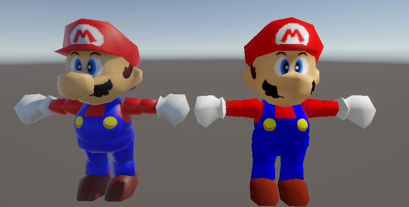
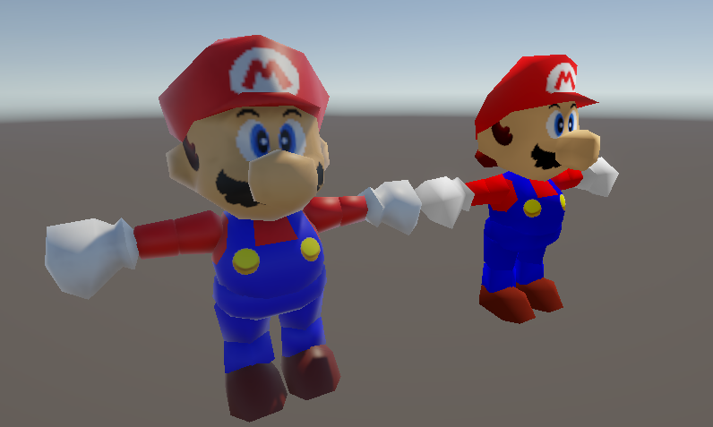
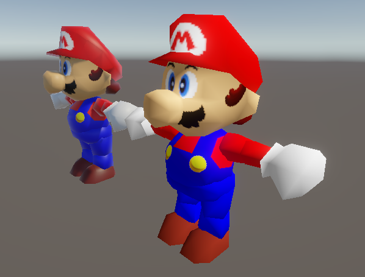

# retro-unity-shaders
A repository for a series of shaders im making.

# N64 Shader
Heres a few examples of the N64 shader. On the left is a mario model using the default URP shader. On the right is the custom N64 shader.

# Other Shaders
This project will include more shaders later, I've only gotten to the N64 one as of now.
